# AGT-FWI-2020 Alpha

*Click [here](./index) to go back to the content.*

In this report, we would show results of two tests. One example of the data is shown as below:

| Time domain | Frequency amplitude |
| :-----: | :-----: |
| 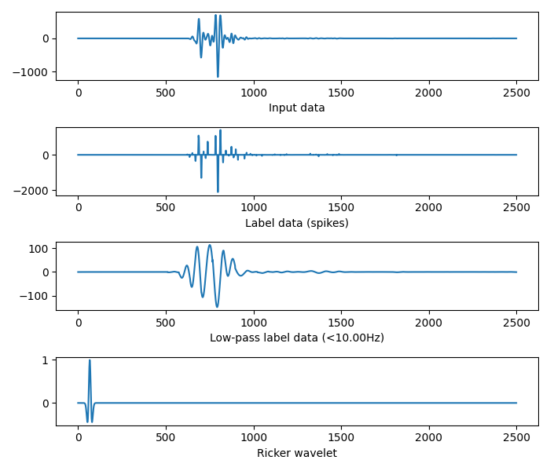 | 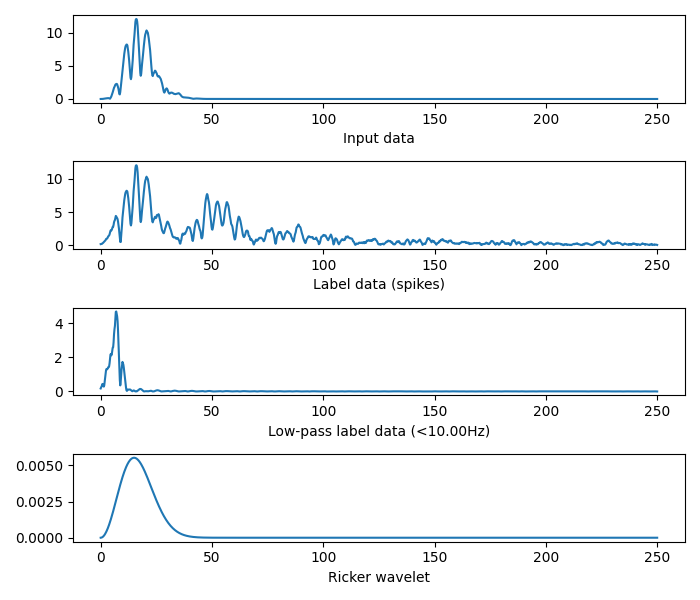 |

In this example,

* The first row is the input data, the range of the frequency is about `(10, 35)`.
* The second row is the label data, it is spiky and given by optimization.
* The third row is the low-pass label data. It is produced by `<10Hz` filter performed on the second row.
* The last row is the ricker wavelet. It shows the relationship between the first row and the second row.

There are two datasets used in this report:

`TDATA_DMBP450x160zD10_56S112R_RICK15HZ`: The input is the first row. The label is the second row.
`TDATA_DMBP450x160zD10_56S112R_RICK15HZ_LOW`: The input is the first row. The label is the third row.

## Test 1

To run this test, use the following codes:

```bash
# Train
python Time_train_alpha.py -train ./datasets/TDATA_DMBP450x160zD10_56S112R_RICK15HZ-train.h5 -test ./datasets/TDATA_DMBP450x160zD10_56S112R_RICK15HZ-test.h5 -model CNN19_ResUNet1 -output ./output
# Test
python Time_eval_alpha.py -test ./datasets/TDATA_DMBP450x160zD10_56S112R_RICK15HZ-test.h5 -model CNN19_ResUNet1 -model_path ./output/models/CNN19_ResUNet1_TDATA_DMBP450x160zD10_56S112R_RICK15HZ-train_state_dict.pt -output ./output
# Prediction
python Time_eval_receiver_wise_alpha.py -model ./output/models/CNN19_ResUNet1_TDATA_DMBP450x160zD10_56S112R_RICK15HZ-train_state_dict.pt -dataset ./datasets/TDATA_DMBP450x160zD10_56S112R_RICK15HZ-test.h5 -output ./output
```

This test is performed on the dataset `TDATA_DMBP450x160zD10_56S112R_RICK15HZ`. To view all results, please check [here](./CNN19_ResUNet1_TDATA_DMBP450x160zD10_56S112R_RICK15HZ).

After training 80 epochs, we could get the training loss:

| Training loss |
| :-----: |
| 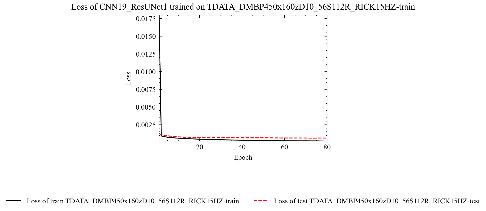 |

We show 4 examples of the predictions here:

| Example | Figure |
| ----- | :-----: |
| Shot 8 | 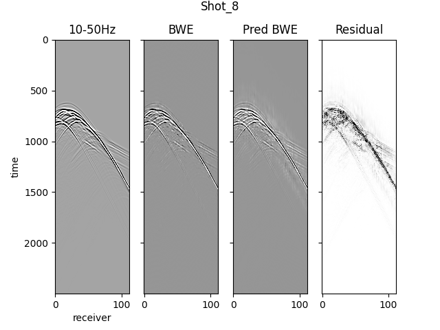 |
| Shot 38 | 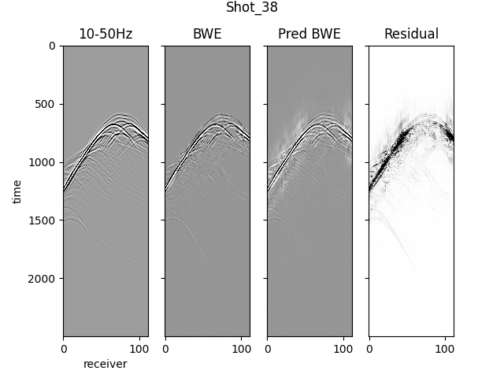 |
| Shot 50 | 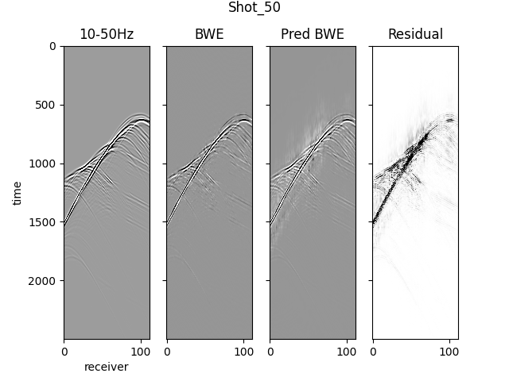 |

The phase plot is shown as:

| Freq. | Figure |
| ----- | :-----: |
| 3Hz | 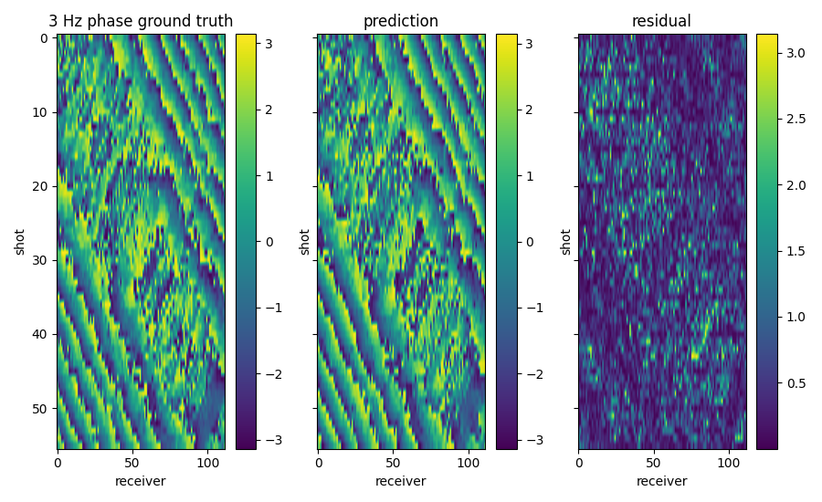 |
| 5Hz |  |
| 7Hz | 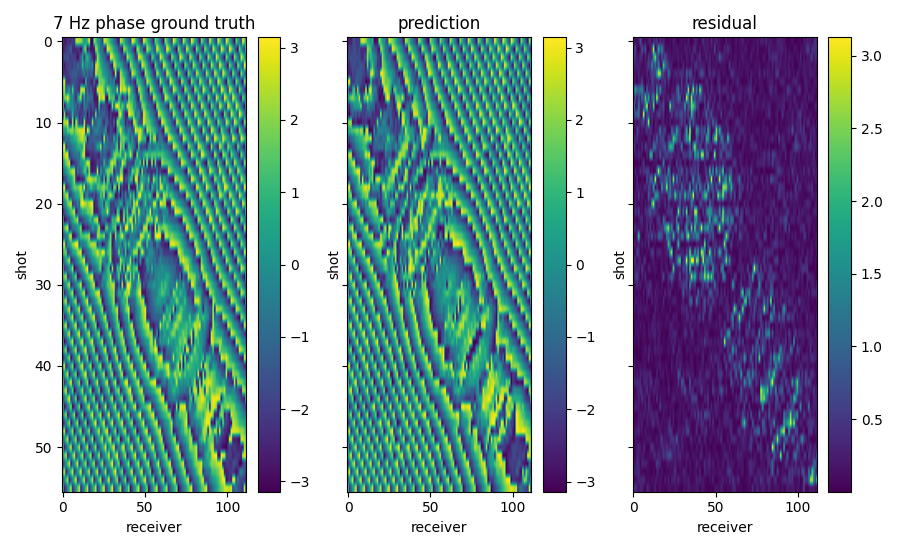 |

We could also show some examples as:

| Example | Figure |
| ----- | :-----: |
| Shot 9, Receiver 62 | 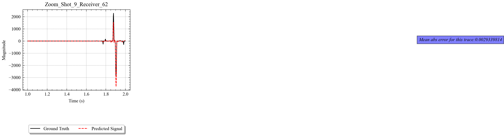 |
| Shot 18, Receiver 25 | 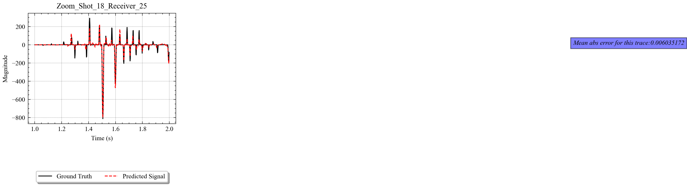 |
| Shot 43, Receiver 101 | 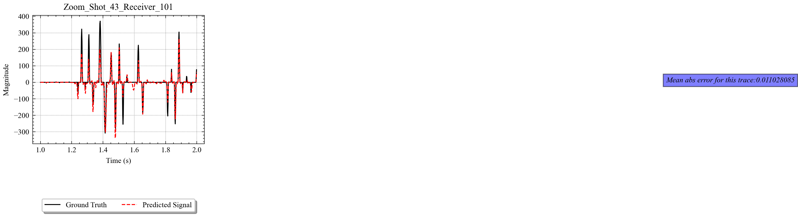 |

We could also show some examples of power spectrums:

| Freq. | Figure |
| ----- | :-----: |
| Shot 9, Receiver 62 | 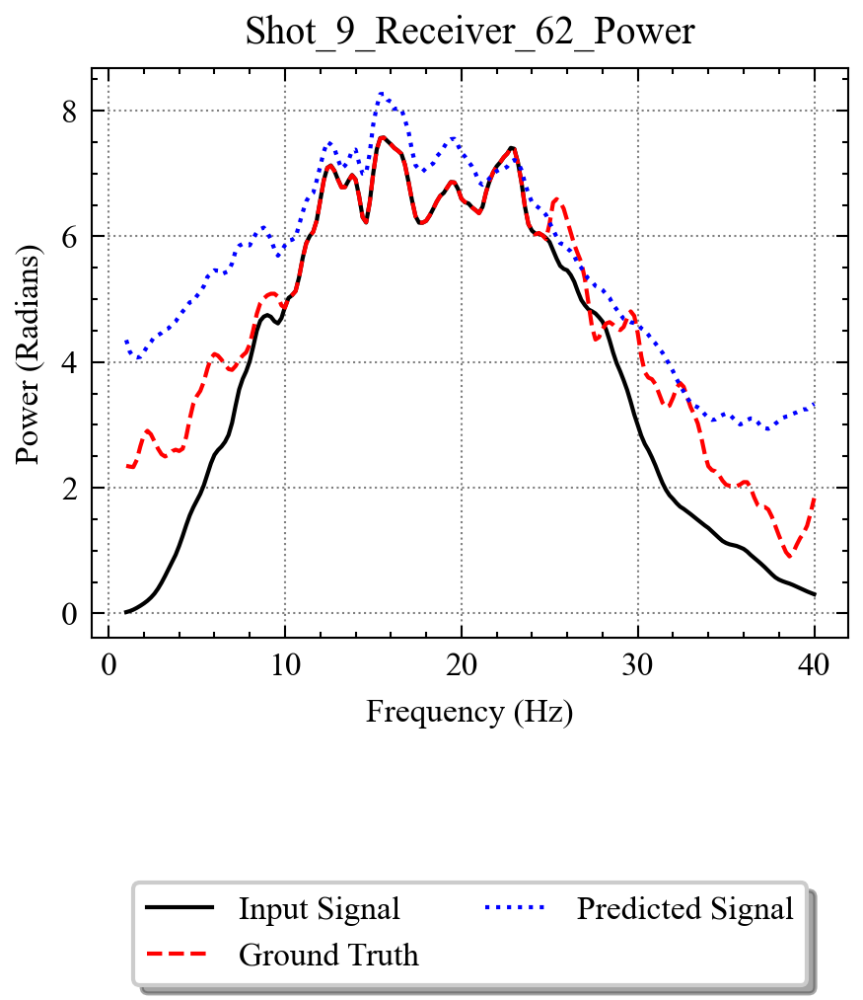 |
| Shot 18, Receiver 25 | 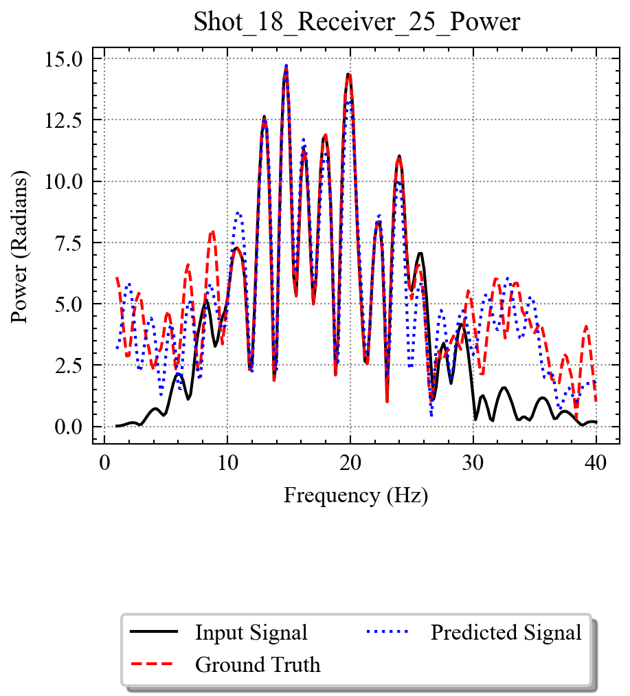 |
| Shot 43, Receiver 101 | 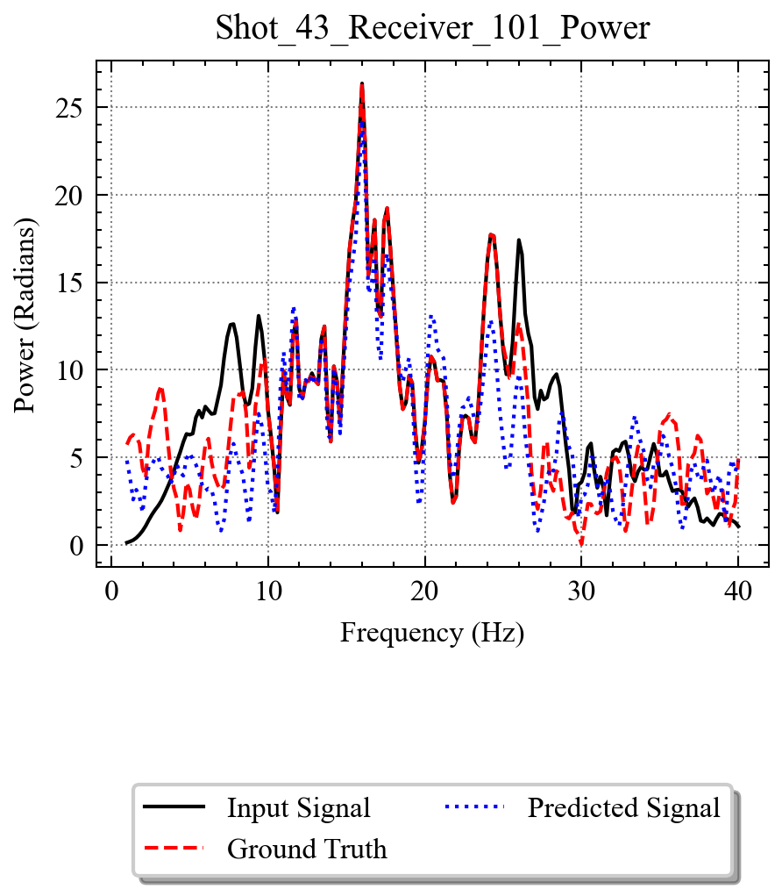 |

## Test 2

To run this test, use the following codes:

```bash
# Train
python Time_train_alpha.py -train ./datasets/TDATA_DMBP450x160zD10_56S112R_RICK15HZ_LOW-train.h5 -test ./datasets/TDATA_DMBP450x160zD10_56S112R_RICK15HZ_LOW-test.h5 -model CNN19_ResUNet1 -output ./output
# Test
python Time_eval_alpha.py -test ./datasets/TDATA_DMBP450x160zD10_56S112R_RICK15HZ_LOW-test.h5 -model CNN19_ResUNet1 -model_path ./output/models/CNN19_ResUNet1_TDATA_DMBP450x160zD10_56S112R_RICK15HZ_LOW-train_state_dict.pt -output ./output
# Prediction
python Time_eval_receiver_wise_alpha.py -model ./output/models/CNN19_ResUNet1_TDATA_DMBP450x160zD10_56S112R_RICK15HZ_LOW-train_state_dict.pt -dataset ./datasets/TDATA_DMBP450x160zD10_56S112R_RICK15HZ_LOW-test.h5 -output ./output
```

This test is performed on the dataset `TDATA_DMBP450x160zD10_56S112R_RICK15HZ_LOW`. To view all results, please check [here](./CNN19_ResUNet1_TDATA_DMBP450x160zD10_56S112R_RICK15HZ_LOW).

After training 80 epochs, we could get the training loss:

| Training loss |
| :-----: |
|  |

We show 4 examples of the predictions here:

| Example | Figure |
| ----- | :-----: |
| Shot 8 |  |
| Shot 38 |  |
| Shot 50 |  |

The phase plot is shown as:

| Freq. | Figure |
| ----- | :-----: |
| 3Hz |  |
| 5Hz |  |
| 7Hz |  |

We could also show some examples as:

| Example | Figure |
| ----- | :-----: |
| Shot 9, Receiver 62 |  |
| Shot 18, Receiver 25 |  |
| Shot 43, Receiver 101 |  |

We could also show some examples of power spectrums:

| Freq. | Figure |
| ----- | :-----: |
| Shot 9, Receiver 62 |  |
| Shot 18, Receiver 25 |  |
| Shot 43, Receiver 101 |  |
